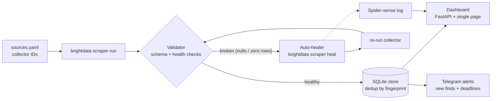

# 🕸️ Opportunity Radar

**Self-healing scrapers that watch the web for scholarships, hackathons and
internships — and repair themselves when sites change.**

Built solo for the WeMakeDevs × Bright Data **Into the Scrape-Verse** hackathon
(Aug 17–23, 2026), powered end-to-end by **Bright Data Scraper Studio**.

## The problem

Life-changing opportunities — scholarships, fellowships, hackathons, internships —
are scattered across small, messy websites that students rarely have time to
check. Aggregators go stale for the same reason every scraper dies: **the site
changes, the scraper breaks, and nobody notices until the data is worthless.**

Opportunity Radar's answer: don't build scrapers that a human must babysit.
Build a pipeline whose scrapers **detect their own failures and heal themselves.**

## How it works



1. **Scrape** — every source is a custom Scraper Studio collector, created from a
   natural-language description with `brightdata scraper create` and executed
   with `brightdata scraper run` (the CLI handles realtime→batch fallback).
2. **Validate** — every run is judged against a schema and health thresholds
   (row counts, null ratios on required fields). Silent failures — the empty
   array, the all-null column — become loud, precise diagnoses.
3. **Heal** — an unhealthy run triggers `brightdata scraper heal` with a
   machine-generated diagnosis built from the validation report ("required
   field 'title' is missing in 8/10 rows…"). The healed collector is re-run and
   re-validated, and the whole intervention lands in the **spider-sense log**.
4. **Deliver** — deduplicated opportunities flow to a dashboard with deadline
   countdowns and pipeline-health panels, and to Telegram alerts, so the data
   actually reaches the students who need it.

## Quickstart

```bash
# 0. prerequisites: Python 3.11+, Node 18+ (for the Bright Data CLI)
pip install -r requirements.txt
npx -p @brightdata/cli brightdata login

# 1. create a collector per source (one-time, ~5–15 min each)
npx -p @brightdata/cli brightdata scraper create \
  "https://devpost.com/hackathons?status[]=open" \
  "Extract open hackathons: title, url, host organization, submission deadline, prize amount, location, themes"
# → Template created: c_xxxxxxxxxxxx   → paste into config/sources.yaml

# 2. configure
cp .env.example .env          # add Telegram credentials (optional)

# 3. run the pipeline
python -m radar.pipeline

# 4. open the dashboard
uvicorn dashboard.app:app --reload   # → http://localhost:8000
```

### Watch it heal itself

```bash
# simulate a site redesign: strips required fields from the scraped rows,
# so the validator fails and the real heal → re-run → re-validate path fires
python -m radar.pipeline --simulate-breakage devpost-hackathons
```

Or break it for real: when a target site actually changes, the next scheduled
run detects the degradation and heals without any flag. Set
`RADAR_AUTO_APPROVE=0` to keep a human approval gate
(`brightdata scraper approve`) in the loop.

### No humans: it heals itself in CI too

`.github/workflows/scrape.yml` runs the whole pipeline nightly in GitHub
Actions (03:00 IST). If a target site changed that day, the run diagnoses
the breakage, heals the collector, re-runs it, and goes green on its own —
the job summary shows every intervention, and each night's data snapshot
is uploaded as an artifact. Setup: add `BRIGHTDATA_API_KEY` (and optionally
the Telegram secrets) in the repo's Actions secrets, then trigger it once
from the Actions tab to see it live.

## Project structure

```
radar/
  config.py      # sources.yaml + env → typed Settings
  models.py      # Opportunity, ValidationReport, HealingEvent (pydantic)
  brightdata.py  # thin wrapper around the Bright Data CLI (run / heal)
  validator.py   # health checks → machine-generated heal diagnoses
  healer.py      # detect → heal → re-run → re-validate orchestration
  store.py       # SQLite: opportunities (deduped), runs, healing events
  alerts.py      # Telegram notifications (degrades gracefully if unset)
  pipeline.py    # entrypoint: python -m radar.pipeline
dashboard/
  app.py         # FastAPI backend (3 JSON endpoints)
  static/        # single-page dashboard (no build step)
config/sources.yaml   # scrape targets + health thresholds
data/example_output.json
tests/                # pytest: validator, store, healer (CLI faked)
```

Run the tests: `make test`

## Deploy (optional)

The included `Dockerfile` runs the dashboard and pipeline in one image
(Python + the Bright Data CLI). On Render/Railway/Fly:

1. New web service → connect this repo → Docker runtime.
2. Environment variables: `BRIGHTDATA_API_KEY` (required — the CLI
   authenticates headlessly with it), `RADAR_RUN_TOKEN` (recommended on
   any public URL: visitors can browse, but only requests carrying this
   token in an `X-Run-Token` header can trigger scraping runs), and
   optionally the Telegram pair.
3. On a cold start with an empty store, the boot script runs one
   pipeline pass automatically so the page shows live data.

Trigger a run remotely:
`curl -X POST https://<your-app>/api/run -H "X-Run-Token: <token>"`

## How Scraper Studio is used

Scraper Studio is not an add-on here — it is the extraction layer *and* the
repair mechanism. Collectors are created from natural language
(`scraper create`), driven from code (`scraper run`), and repaired by AI with
diagnoses this pipeline writes for it (`scraper heal --auto-approve`). The
project deliberately avoids Bright Data's pre-built scrapers: every collector
is custom, targeting sites (Devpost, Buddy4Study, Wellfound) whose layouts
change often — which is exactly the point.

Only **publicly available** data is scraped: no logins, no paywalls, no
personal data, no government sites — per the hackathon rules.

## Hardening

The app assumes both its inputs and its clients can be hostile:

- **Scraped data is untrusted.** Every row passes schema validation;
  only `http(s)` URLs survive (no `javascript:`/`data:` links can reach
  the dashboard), titles are length-capped, and the frontend escapes all
  text it renders.
- **Config is validated at load.** `sources.yaml` fails fast on duplicate
  or malformed ids, non-http(s) URLs, malformed collector IDs, and
  government/military domains (disallowed by the hackathon rules).
- **The API is rate-limited per client IP** (sliding window: 120/min reads,
  3/min for `POST /api/run`) with `429 + Retry-After` on excess; query
  params are strictly typed and bounded (`category` enum, `limit ≤ 500`).
- **`POST /api/run` is the expensive endpoint** (it spends scraping
  credits), so it's single-flight with a 60s cooldown, and can be
  token-gated via `RADAR_RUN_TOKEN` for public deployments.
- **Security headers** (CSP, nosniff, frame-deny, no-referrer) ship on
  every response; API error responses never leak internals; secrets stay
  in `.env` (gitignored) and CLI calls use argument lists, never a shell.

Behind a reverse proxy, run uvicorn with `--proxy-headers` so the rate
limiter sees real client IPs.

## AI usage disclosure

AI tools were used in this project, as permitted by the hackathon rules:
Scraper Studio's AI generates and heals the collectors (that's the sponsor
platform itself), and an AI coding assistant (Claude) was used to help
scaffold and refine code and docs. All architecture decisions, integration,
site selection, testing and debugging are my own, and I understand and can
explain every part of the submitted code.

## License

MIT — see [LICENSE](LICENSE).
